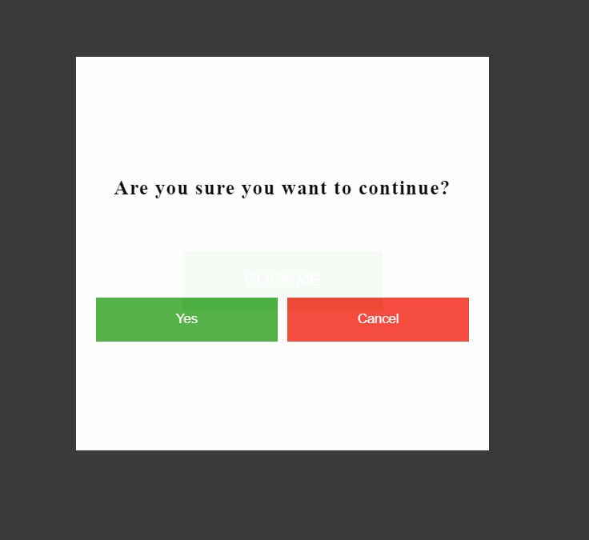

# Sitemate stage 2 challenge

Create a reusable confirmation dialog component by using vanilla javascript, html and css in 2hours

   <kbd>
    
   </kbd>

 

# Live demo

[live demo](https://hamzaoutdoors.github.io/stage2_quiz/)

